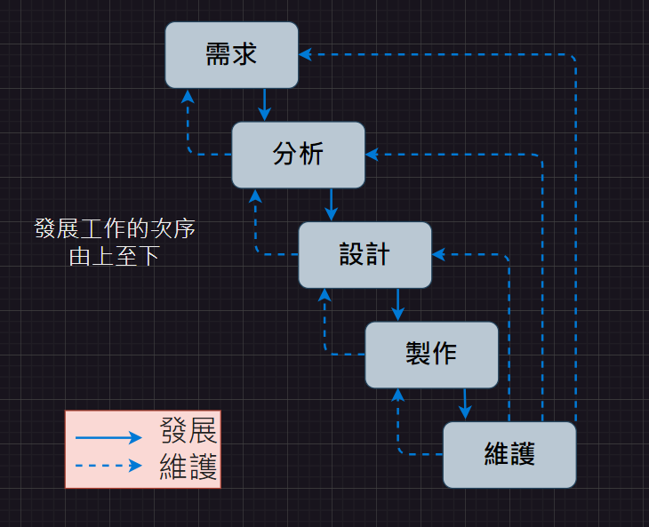

# 第1次隨堂-隨堂-QZ1
>
>學號：111111109
> 
>姓名：張雅薰
> 
>作業撰寫時間：20 (mins，包含程式撰寫時間)
> 
>最後撰寫文件日期：2024/03/15
>

本份文件包含以下主題：(至少需下面兩項，若是有多者可以自行新增)
- [x] 說明內容
- [x] 個人認為完成作業須具備觀念

## 說明程式與內容

簡述系統分析工作 
1.需求調查:了解使用者的需求、期望。 
2.可行性研究:評估系統項目的可行性，包括技術、經濟和組織。 
3.定義需求:明確定義系統的功能和特性。 
4.撰寫規格書:將定義的需求轉化為系統規格書或需求文檔。 
5.擬訂可行方案:選擇技術架構、開發方法、時間表和預算等方面的安排。 
6.管理者確認:與對方管理人員確認。 
畫出「瀑布式軟體發整程序」 

## 個人認為完成作業須具備觀念
學習到完成系統分析工作需要掌握一系列關鍵觀念。 
首先是需求管理，理解和管理使用者的需求，確保系統設計符合其期望。 
其次是系統設計原則，確保系統具有高效性和可擴展性。 
再者是專案管理技巧，能夠有效地組織和管理專案，確保按時完成。 
最後是溝通與合作，能夠與利益相關者溝通並有效合作，以確保項目順利進行。
